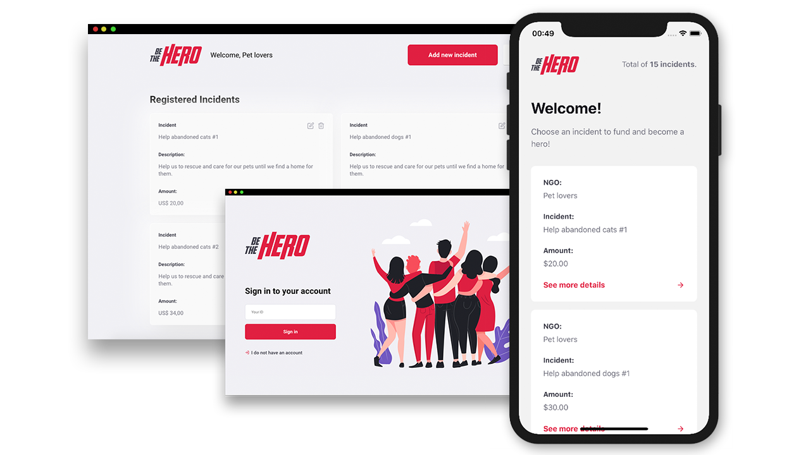

<p align="center">
  
  
  <p align="center">
  App to help NGOs built with ReactJS, React Native, Node.js and more.
  </p>

  

  > This project was made for learning purposes only and comes from Rocketseat's omnistack week crash course #11 with my own modifications
</p>

# App
[Website](https://be-the-hero-app.netlify.com/)

[Server](https://be-the-hero-app.herokuapp.com/ngos)

## Download
<a href="https://github.com/daltonmenezes/be-the-hero/releases/download/v1.0.0/dalton-menezes-be-the-hero.apk"></a>

# Development setup

> yarn is required

After cloning this repo:
### Server 
  - Run ```yarn``` in the ```server``` folder
  - Go back to the root folder
  - Run ```yarn dev:server``` to up the server
  - Open ```Insomnia``` or ```Postman``` and import the ```Insomnia.json``` workspace file at ```server``` folder
  - Use it! :D
### Website
  - Run ```yarn``` in the ```website``` folder
  - Go back to the root folder
  - Run ```yarn dev:web``` to up the project
### Mobile
  - Run ```yarn``` in the ```mobile``` folder
  - Update the ```baseURL``` at ```src/config/index.js```
  - Go back to the root folder
  - Run ```yarn dev:mobile``` to up the project

# Tests
### Server
  - Run ```yarn test:server``` at the root folder
  
  
# Improvements
I made some improvements like:

- Making the possibility to edit the incidents
- Adding neumorphism on parts of the website
- Adding the generated ID from registration automatically in the login field
- Adding the validation of all necessary routes
- Adding more tests
- Improving the tests architecture and organization
- Improving the code architecture and organization
- Deploying and setting the website on Netlify
- Deploying and setting the server on Heroku

# License
[MIT License](/LICENSE)
